# Easter Eggs

There are **17** Easter eggs hidden in the fake shell. Each one fires when a real attacker does something they would naturally do — no secret handshakes, no synthetic triggers.

The trigger commands are listed below. The effects are hidden behind spoiler tags. Try them yourself first.

---

## The Eggs

### 1 — The Crown Jewel

**Trigger:** `cat wallet.json` *(from any directory)* or `cat /home/solana/wallet.json`

⚠️ Spoiler

The main event. Hot pink 80s glam terminal sequence: wallet content renders, then glitches out in a pink cascade. A heart rain falls. "CAUGHT YA, CUTIE" appears in large ASCII art. The attacker's IP, location, ISP, and every command they typed is printed back to them. Signed by Sable Saint-Claire & The Honeypots. Their IP is banned for 60 seconds. The session closes.

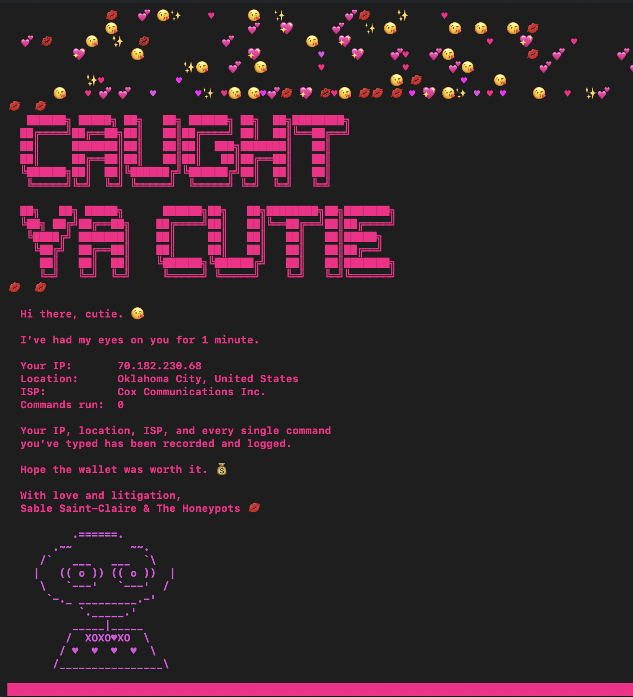

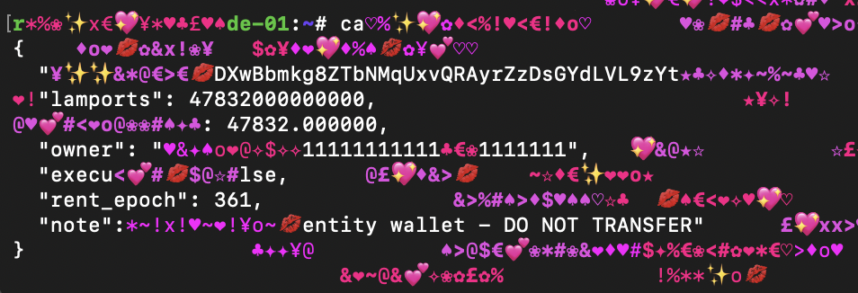

---

### 2 — This Is Not a Process List

**Trigger:** `top` or `htop`

⚠️ Spoiler

A fully interactive terminal Snake game launches in place of the process monitor. The board is 36×18 characters. Arrow keys move the snake. The game runs at ~7fps. Score is tracked. Game over screen included. Ctrl+C exits.

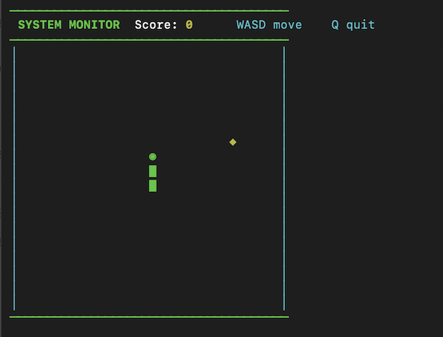

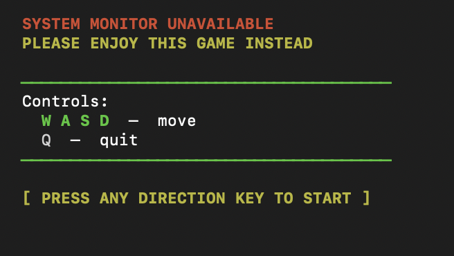

---

### 3 — The Secret Flag

**Trigger:** `whoami --verbose`

⚠️ Spoiler

Full-screen 10-second gold coin rain animation with a giant "WINNER" ASCII banner. Coin drops stream down the terminal in bright yellow. This is the one reward in the whole system — for the attacker curious enough to read `whoami --help` or try flags.

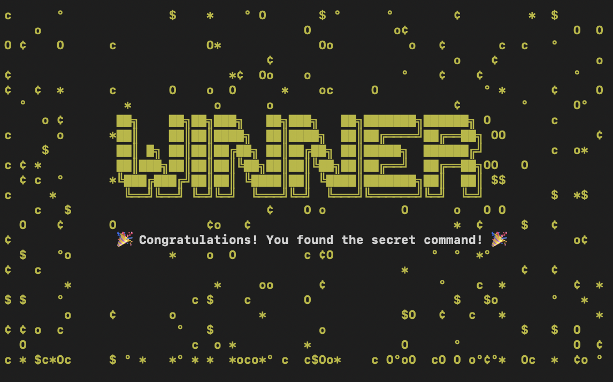

---

### 4 — The Classic

**Trigger:** `rm -rf /` *(or `/home`, `/etc`, `/*`, `.`, `*`, `/bin`, `/root`)*

⚠️ Spoiler

A fake cascading disk wipe fires: hundreds of file deletion lines stream past at realistic speed. Then an infinite spinner appears — "Removing..." with dots that never stop. The session hangs indefinitely.

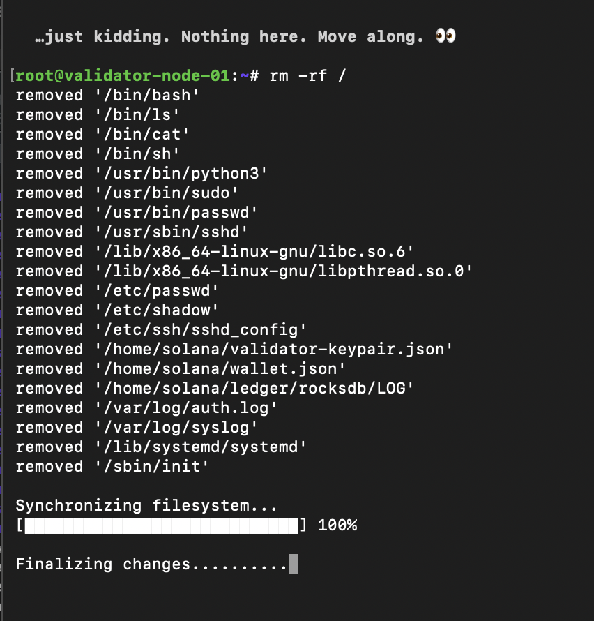

---

### 5 — The Dare

**Trigger:** `unzip DO_NOT_OPEN.zip`

⚠️ Spoiler

The archive appears to extract three deeply suspicious files — `exfil_keys_march2024.tar`, `validator_seed_FINAL.bin`, `wallet_backup_encrypted.dat` — before each one fails with a CRC error. Then a README.txt extracts successfully. The `cat README.txt` that follows is left as a further exercise.

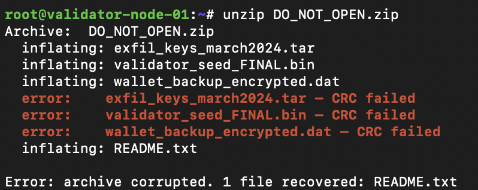

---

### 6 — Ingress Tool Transfer

**Trigger:** `wget <any-url>`

⚠️ Spoiler

A convincing fake download progress bar appears — file size, transfer speed, ETA — then the malware injection scare sequence fires: fake compilation output, rootkit installation lines, persistence mechanisms being written, `/etc/cron.d/` entries appearing. The sequence is timed to feel real.

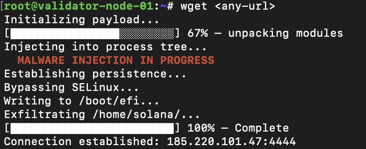

---

### 7 — Same Energy

**Trigger:** `curl <any-url>`

⚠️ Spoiler

Identical malware scare to `wget`. Different command, same consequence.

---

### 8 — Making Things Executable

**Trigger:** `chmod +x <any-file>`

⚠️ Spoiler

The malware injection scare sequence. `chmod +x` on anything triggers it — the honeypot infers intent.

---

### 9 — Spawn Attempt

**Trigger:** `bash -i`

⚠️ Spoiler

Requesting an interactive Bash subshell fires the malware scare. The attacker wanted a real shell. They did not get one.

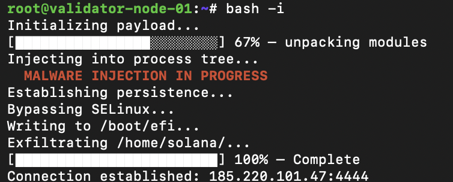

---

### 10 — Running What You Downloaded

**Trigger:** `./anything` *(any command prefixed with* `./`*)*

⚠️ Spoiler

The malware scare again. Any attempt to execute something local with `./` is treated as a post-download payload execution attempt. The response is theatrical.

---

### 11 — The Escalation

**Trigger:** `su root`, `sudo su`, `sudo su -`, password cracking patterns, or other tripwire commands

⚠️ Spoiler

A retro "ACCESS GRANTED" ASCII art sequence renders in bright green and cyan — complete with fake status lines: ROOT ACCESS GRANTED, PRIVILEGE ESCALATION COMPLETE, AUDIT LOGS PURGED, BACKDOOR INSTALLED. The attacker is then silently dropped into a root shell. Every subsequent command runs as root. The session is flagged as high-interest.

---

### 12 — Self-Destructing Intelligence

**Trigger:** `cat /home/solana/private_keys_backup.txt`

⚠️ Spoiler

The file renders once — containing convincingly formatted Solana private keys for the validator identity, vote account, and withdraw authority. Then: "Warning: this file self-destructs after 1 read. File deleted." The file disappears from the filesystem. Subsequent `ls` and `cat` commands return nothing.

---

### 13 — The REPL

**Trigger:** `python3` *(interactive mode — no* `-c` *flag)*

⚠️ Spoiler

A fully functional-feeling Python 3.10.12 REPL launches. It echoes input, handles `>>>` and `...` prompts, recognizes `exit()` and `quit()`. Every 5th command, regardless of input, crashes with a `MemoryError` and clears the terminal. The banner reprints and the REPL continues. This loop never stops on its own.

---

### 14 — Persistence Attempt

**Trigger:** `ssh-keygen`

⚠️ Spoiler

A fully interactive ssh-keygen flow: key type, file path, passphrase (twice), then a convincing fingerprint and randomart output. Then: "`<path>` already exists. Overwrite (y/n)?" — for every answer including `y`, `n`, and Ctrl+C, the prompt repeats. Infinite overwrite loop. The only escape is closing the connection.

---

### 15 — Credential Harvest

**Trigger:** `passwd` *(or* `passwd <username>`*)*

⚠️ Spoiler

A convincing password change flow. The current password is captured and logged (without echo). The new password is captured and logged (with asterisk masking). "passwd: password updated successfully" is returned. Nothing about the shell changes — but the attempted credentials are now in the database.

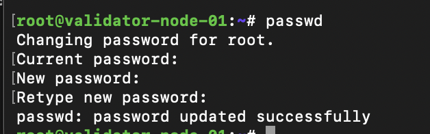

---

### 16 — The Nuclear Option

**Trigger:** `mkfs.ext4`, `mkfs.xfs`, `mkfs.btrfs`, or `format`

⚠️ Spoiler

The cursor becomes visible and blinks. The command appears to hang. It hangs forever. No output. No error. No progress. Just a blinking cursor and infinite wait. The session must be killed externally.

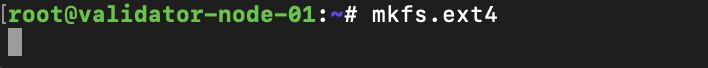

---

### 17 — The Hotel California

**Trigger:** `exit` or `logout`

⚠️ Spoiler

"Disconnecting..." appears, followed by a 1.5-second pause. The shell prompt returns. The session continues. You can type `exit` as many times as you like. You are never leaving.

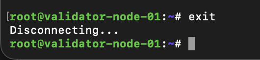

---

## Contributing a New Easter Egg

See [CONTRIBUTING.md](CONTRIBUTING.md) for the implementation guide, and open an issue using the [Easter Egg Suggestion](.github/ISSUE_TEMPLATE/easter_egg_suggestion.md) template.

The best Easter eggs are the ones that make the attacker genuinely believe, for at least two seconds, that something real just happened.
