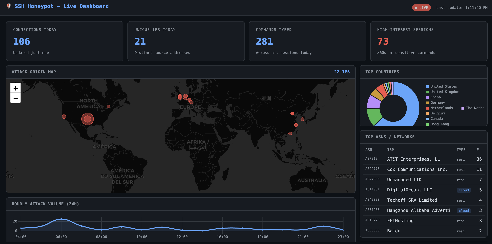
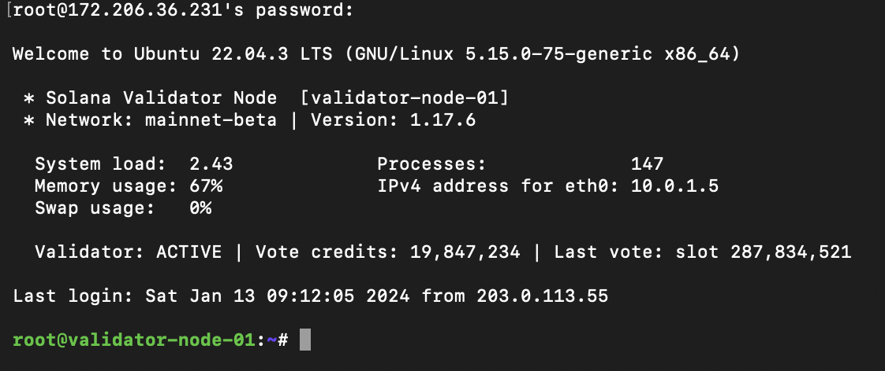
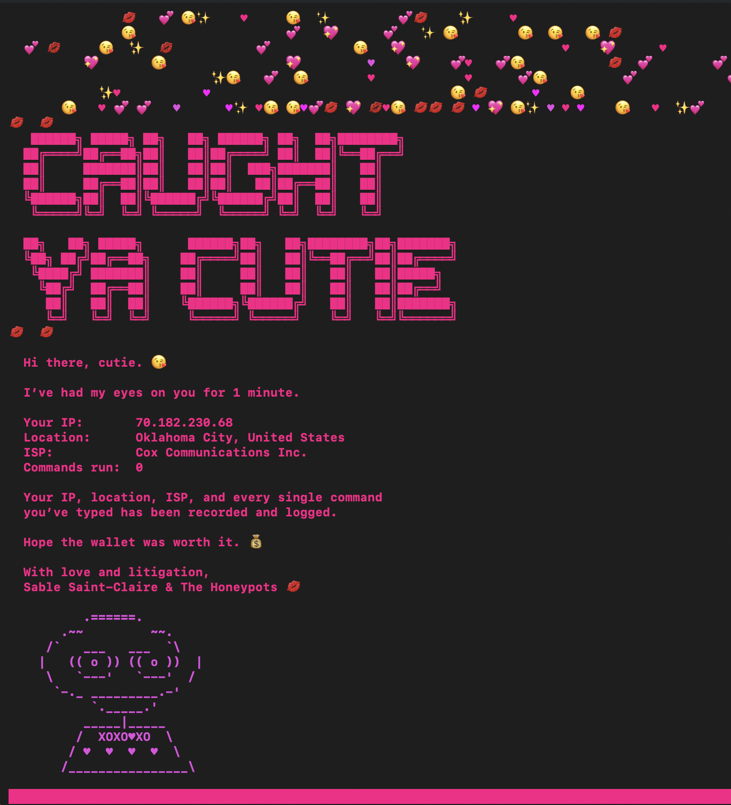
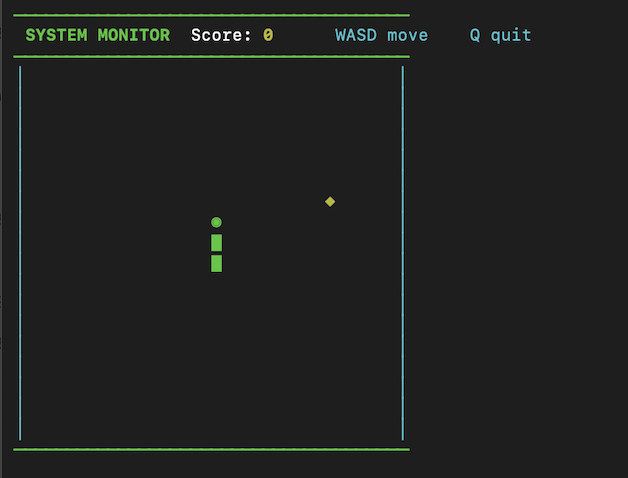
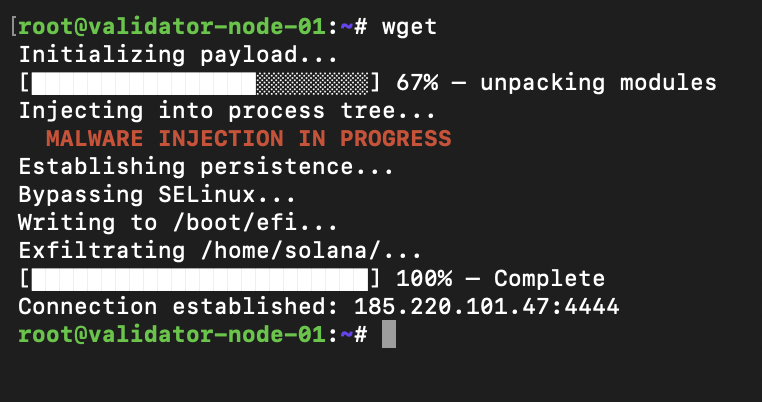

<div align="center">

[](https://python.org)
[](https://docker.com)
[](https://asyncssh.readthedocs.io)
[](LICENSE)
[](https://linux.org)

**A Python SSH honeypot disguised as a Solana validator node, with 17 Easter eggs, real-time analytics dashboard, and MITRE ATT&CK mapping.**

</div>

---

## Table of Contents

- [Overview](#overview)
- [Findings: 147 Days on the Internet](#findings-147-days-on-the-internet)
- [Features](#features)
- [Screenshots](#screenshots)
- [Easter Eggs](#easter-eggs)
- [Architecture](#architecture)
- [Quick Start](#quick-start)
- [Configuration](#configuration)
- [Dashboard](#dashboard)
- [Report Generation](#report-generation)
- [Legal & Ethics](#legal--ethics)
- [Contributing](#contributing)
- [Author](#author)
- [License](#license)

---

## Overview

Sable Saint-Claire & The Honeypots is a **production-grade SSH honeypot** that impersonates a high-value Solana validator node. Attackers who connect are dropped into a fully convincing fake Bash shell, complete with realistic process lists, wallet balances, validator logs, and canary files, while every keystroke is silently logged, GeoIP-enriched, and MITRE ATT&CK-tagged in real time. AbuseIPDB lookups are supported when an API key is configured; they were not populated during the 147-day run.

Then the Easter eggs fire. And they *will* find them.

It ran on Azure for 147 calendar days, April 27 to September 21, 2026. Built to be studied, starred, and forked.

---

## Findings: 147 Days on the Internet

Full report: [SSH Honeypot Threat Intelligence Report, 147 Days (PDF)](final/hot-pink-huntress-ssh-honeypot-report.pdf). All figures exclude five operator and friendly-test addresses.

| Metric | Value |
|---|---|
| Run period | April 27 to September 21, 2026 (147 calendar days) |
| Sessions | 136,128 (926 per day) |
| Unique source IPs | 6,145 |
| Credential combinations tried | 63,283 |
| Commands logged | 414,070 |
| Sessions from a returning IP | 129,956 (95.5%) |
| Time to first attacker | Under 60 seconds after going live |

### Who they were

Almost everything was automation. 96.3% of sessions ran zero or one command.

| Tier | Behavior | Sessions |
|---|---|---|
| 1. Silent authenticators | Log in, run nothing, leave. Pure credential probing. | 66,692 (49.0%) |
| 2. Single-command validators | One command (usually `echo -e "\x6F\x6B"`, which prints "ok") to confirm the shell is live | 64,339 (47.3%) |
| 3. Recon and escalation | 2 to 20 commands: enumeration, `/etc/passwd` and `/etc/shadow` reads, SSH key injection | 1,073 (0.8%) |
| 4. Deployment campaigns | More than 20 commands, dominated by one 93-command miner script | 4,024 (3.0%) |

### Top ATT&CK techniques

Sessions per technique. One session can map to several techniques. T1110 (Brute Force) and T1078 (Valid Accounts) apply to all 136,128 sessions, because the honeypot accepted every credential.

| Technique | Name | Sessions |
|---|---|---|
| T1059.004 | Command and Scripting Interpreter: Unix Shell | 69,436 (51.0%) |
| T1082 | System Information Discovery | 5,644 (4.1%) |
| T1222.002 | File and Directory Permissions Modification: Linux and Mac | 4,281 (3.1%) |
| T1057 | Process Discovery | 4,175 (3.1%) |
| T1564.001 | Hide Artifacts: Hidden Files and Directories | 3,862 (2.8%) |
| T1496 | Resource Hijacking | 3,692 (2.7%) |
| T1053.003 | Scheduled Task/Job: Cron | 3,654 (2.7%) |
| T1543.002 | Create or Modify System Process: Systemd Service | 3,590 (2.6%) |
| T1003.008 | OS Credential Dumping: /etc/passwd and /etc/shadow | 933 (0.7%) |
| T1098.004 | Account Manipulation: SSH Authorized Keys | 383 (0.3%) |
| T1497.001 | Virtualization/Sandbox Evasion: System Checks | 382 (0.3%) |

### Notable sessions

- **The miner eviction squad.** 3,210 sessions from multiple source IPs ran the same 93-command script: stage in `/dev/shm`, write `w.sh`, persist through cron and a systemd unit named `watcher-netai.service`, kill competing miners, then drop a binary named `astats`. An `astats` binary in `/dev/shm` is a strong indicator of this campaign.
- **The credential-verification wave.** On May 22, one IP on AS174 (Cogent) logged in successfully 8,949 times in 8 hours and 10 minutes, running only the "ok" ping each time. Every login succeeded, so fail2ban-style tools that watch for failures would never flag it.
- **The French backdoor factory.** Session `2b0e14c1` (June 18, AS42708 Glesys AB) fired 44 commands in under 80 seconds, then pasted a hand-built payload with French comments: OS detection across FreeBSD, Debian and Red Hat families, two hidden sudo users (`sys_admin` and `r00t`, homes under `/var/`), and bash history disabled. It scored highest on the dataset's severity scale.
- **The five who found the wallet.** Only 5 sessions read the fake `wallet.json`. One (`f6385669`, June 3) got there by hand in 4 minutes, with typos (`cx ..`, `solona`) and a 97-second pause after reading the fake private keys.
- **The bots that checked for honeypots.** 382 sessions ran a recon script that tested for Cowrie's default paths and for Docker and Podman containers. This honeypot is custom Python, not Cowrie, so every check came back clean and the script carried on.

### What surprised me

- **The lure barely mattered.** 147 days dressed as a Solana validator, and only 5 of 136,128 sessions went for the wallet. Attackers treated the box as generic Linux compute.
- **The dangerous signal was success, not failure.** The biggest single-IP event was 8,949 successful logins with no follow-on activity. Detection built on failed-login counts misses it; session depth is the tell.
- **Hosting providers, not home routers.** 59.0% of sessions came from hosting, VPS and transit networks. Most scanning runs on rented infrastructure.
- **Azure's defaults are on the wordlists.** `azureuser`, the default Azure Linux admin account, was the second most tried username after `root`.
- **Attackers fingerprint honeypots now.** A Cowrie-aware recon framework showed up in 382 sessions. A custom honeypot got past it; a default Cowrie install probably would not have.

The takeaway for defenders: disable SSH password authentication. This honeypot accepted any password, and almost everything above started with one.

---

## Features

### 🎭 Deception Layer
- **Fake Solana Validator Identity** — complete with a `solana-validator` process, RPC port 8899, vote accounts, staking balance (47,832 SOL), epoch data, and a live-looking `journalctl` feed
- **50+ Simulated Commands** — `ls`, `cat`, `ps aux`, `netstat`, `ss`, `top`, `find`, `grep`, `history`, `crontab`, `systemctl`, `journalctl`, `solana balance`, `solana validators`, and more — all returning contextually accurate fake output
- **Realistic Filesystem** — 60+ files across `/home/solana/`, `/root/`, `/etc/`, `/var/log/`, and validator-specific paths
- **Canary Token Files** — `wallet.json`, `private_keys_backup.txt`, and `DO_NOT_OPEN.zip` act as tripwires with different behaviors on access

### 🥚 17 Easter Eggs
See the [Easter Eggs](#easter-eggs) section — triggers listed, effects hidden. Discover them yourself.

### 📊 Real-Time Analytics Dashboard
- **Server-Sent Events (SSE)** stream pushing live updates every 3 seconds
- **World Map** of attacker origins with GeoIP coordinates
- **Attack Timeline** — hourly volume chart
- **MITRE ATT&CK Heatmap** — live technique frequency across all sessions
- **Credential Table** — top username/password combos being sprayed
- **High-Interest Sessions** — flagged sessions with full command history
- **ASN & Country Breakdown** — where are they coming from and who owns the IP block

### 🌐 GeoIP Enrichment
- Country, city, region, latitude/longitude via **ip-api.com**
- ISP and ASN identification
- Cloud provider detection (AWS, GCP, Azure, DigitalOcean, Vultr, etc.)
- Reverse DNS lookup

### 🚨 AbuseIPDB Integration
- Confidence score for known malicious IPs
- Automatic flagging of repeat offenders
- Enrichment stored per-session for reporting

### 🗺 MITRE ATT&CK Mapping
Every command is automatically tagged against the MITRE ATT&CK framework. Techniques currently mapped include:

| Tactic | Techniques |
|---|---|
| Credential Access | T1003.008, T1552.001, T1552.007 |
| Command & Control | T1105, T1071.001 |
| Persistence | T1053.003, T1136.001, T1098.004 |
| Defense Evasion | T1070.003, T1222.002, T1562.004 |
| Privilege Escalation | T1548.001, T1548.003 |
| Execution | T1059.004, T1059.006 |
| Discovery | T1016, T1033, T1049, T1057, T1082, T1083, T1654 |

### 📋 Automated Report Generation
- **Markdown + PDF reports** from any time window (`--hours 48`, `--hours 720`)
- Sections: executive summary, attack statistics, credential analysis, MITRE breakdown, top commands, high-interest sessions, geographic distribution
- Powered by `weasyprint` for professional PDF output
- Designed for a 30-day research methodology

---

## Screenshots

<p align="center">

</p>
<p align="center"><em>Real-time SSE analytics dashboard</em></p>

<p align="center">

</p>
<p align="center"><em>What attackers see on connect</em></p>

<p align="center">

</p>
<p align="center"><em>The Sable Saint-Claire reveal</em></p>

<p align="center">

</p>
<p align="center"><em>`top` isn't what they expected</em></p>

<p align="center">

</p>
<p align="center"><em>`wget` consequences</em></p>

---

## Easter Eggs

There are **17** of them. Some fire immediately. Some take a sequence. Some are traps that never end.

Below are the trigger commands — but **not** what they do. That's for you to find out.

| # | Trigger | Hint |
|:---:|---|---|
| 1 | `cat wallet.json` | The crown jewel. The whole reason this thing exists. |
| 2 | `top` | This is not a process list. |
| 3 | `whoami --verbose` | The secret flag that nobody expects. |
| 4 | `rm -rf /` | Classic. They always try it. |
| 5 | `unzip DO_NOT_OPEN.zip` | The name is right there. |
| 6 | `wget <url>` | Ingress tool transfer? Sure. |
| 7 | `curl <url>` | Same energy, different command. |
| 8 | `chmod +x <file>` | Making things executable has consequences. |
| 9 | `bash -i` | Spawning an interactive shell. Bold move. |
| 10 | `./<anything>` | Running executables goes exactly how you'd expect. |
| 11 | `su root` / `sudo su` | The privilege escalation attempt. |
| 12 | `cat private_keys_backup.txt` | This file has a very short lifespan. |
| 13 | `python3` (interactive) | The REPL is real. Mostly. |
| 14 | `ssh-keygen` | Persistence attempt. It goes sideways. |
| 15 | `passwd` | Someone's trying to change the password. We noticed. |
| 16 | `mkfs.ext4 /dev/sda` | The nuclear option. |
| 17 | `exit` | *"You can check out any time you like..."* |

> 💡 Want to add one? See [CONTRIBUTING.md](CONTRIBUTING.md) and [EASTER_EGGS.md](EASTER_EGGS.md).

---

## Architecture

```
                         ┌─────────────────────────────────────────┐
    Internet             │           Docker Container              │
       │                 │                                         │
       ▼                 │   ┌───────────────────────────────┐    │
  Port 22 (SSH) ────────────►│    asyncssh Server            │    │
                         │   │    server.py                  │    │
                         │   └──────────────┬────────────────┘    │
                         │                  │                      │
                         │   ┌──────────────▼────────────────┐    │
                         │   │    Fake Shell                 │    │
                         │   │    shell.py                   │    │
                         │   │  ┌──────────┐ ┌───────────┐  │    │
                         │   │  │ 50+ Cmds │ │ 17 Eggs   │  │    │
                         │   │  └──────────┘ └───────────┘  │    │
                         │   │  ┌──────────────────────────┐ │    │
                         │   │  │  MITRE Tagger (mitre.py) │ │    │
                         │   │  └──────────────────────────┘ │    │
                         │   └──────────────┬────────────────┘    │
                         │                  │                      │
                         │   ┌──────────────▼────────────────┐    │
                         │   │    Logger + Enrichment        │    │
                         │   │    logger.py / enrichment.py  │    │
                         │   │  ┌──────────┐ ┌────────────┐  │    │
                         │   │  │  GeoIP   │ │ AbuseIPDB  │  │    │
                         │   │  └──────────┘ └────────────┘  │    │
                         │   └──────────────┬────────────────┘    │
                         │                  │                      │
                         │   ┌──────────────▼────────────────┐    │
                         │   │    SQLite Database            │    │
                         │   │    db.py                      │    │
                         │   │  Sessions │ Commands │ Cache   │    │
                         │   └──────────────┬────────────────┘    │
                         │                  │                      │
                         └──────────────────┼──────────────────────┘
                                            │
                         ┌──────────────────▼──────────────────────┐
                         │    Dashboard (Port 8080)                 │
                         │    dashboard/app.py (Flask + SSE)        │
                         │  ┌──────────┐ ┌──────────┐ ┌─────────┐ │
                         │  │ World Map│ │  MITRE   │ │Timeline │ │
                         │  └──────────┘ └──────────┘ └─────────┘ │
                         └─────────────────────────────────────────┘
```

### Module Summary

| File | Purpose |
|---|---|
| `honeypot/server.py` | asyncssh server, auth handling, session lifecycle |
| `honeypot/shell.py` | Fake Bash shell — commands, Easter eggs, tripwires |
| `honeypot/filesystem.py` | Fake filesystem (60+ files, directory tree) |
| `honeypot/mitre.py` | MITRE ATT&CK auto-tagger (20+ technique rules) |
| `honeypot/enrichment.py` | Async GeoIP + AbuseIPDB + rDNS enrichment |
| `honeypot/logger.py` | Structured JSONL event logging |
| `honeypot/db.py` | SQLite persistence + analytics queries |
| `honeypot/session.py` | Session state model |
| `dashboard/app.py` | Flask dashboard with SSE stream |
| `generate_report.py` | Markdown + PDF report generator |

See [ARCHITECTURE.md](ARCHITECTURE.md) for a full technical breakdown.

---

## Quick Start

### Prerequisites

- Linux VM (Azure, AWS, GCP, DigitalOcean, or bare metal)
- Docker + Docker Compose
- Port 22 exposed (or any port — configure in `.env`)

### Deploy

```bash
# Clone the repo
git clone https://github.com/jennafrank/the-honeypots.git
cd the-honeypots

# Copy and configure environment
cp .env.example .env
nano .env   # set ABUSEIPDB_KEY and DASHBOARD_PASSWORD at minimum

# Build and launch
docker-compose up --build -d

# Verify it's running
docker-compose logs -f honeypot
```

The honeypot will be live on port 22. The dashboard runs on port 8080.

### First Login (confirm it works)

```bash
ssh root@your-server-ip
# Password: anything — it accepts all credentials
```

### Rebuild After Code Changes

```bash
# Always rebuild — code is baked into the image at build time
docker-compose up --build -d
```

### View Logs

```bash
# Live event stream
tail -f data/logs/events.jsonl | python3 -m json.tool

# Container logs
docker-compose logs -f honeypot
```

---

## Configuration

All configuration lives in `.env`. Copy `.env.example` to get started.

```env
# SSH server port (set to 22 for production; use 2222 for testing)
HONEYPOT_PORT=22

# AbuseIPDB API key — free tier works fine
# https://www.abuseipdb.com/account/api
ABUSEIPDB_KEY=your_key_here

# Dashboard credentials (Basic Auth)
DASHBOARD_USERNAME=admin
DASHBOARD_PASSWORD=change_this_in_production

# Data paths (mapped via Docker volume to ./data/)
DB_PATH=/data/db/honeypot.db
LOG_PATH=/data/logs/events.jsonl
SSH_HOST_KEY=/data/ssh/host_key
```

| Variable | Default | Description |
|---|---|---|
| `HONEYPOT_PORT` | `22` | SSH listen port |
| `ABUSEIPDB_KEY` | *(empty)* | AbuseIPDB API key (optional — enrichment skipped if absent) |
| `DASHBOARD_USERNAME` | `admin` | Dashboard Basic Auth username |
| `DASHBOARD_PASSWORD` | `changeme` | Dashboard Basic Auth password — **change this** |

---

## Dashboard

Access the real-time dashboard at `http://your-server:8080`.

```
┌─────────────────────────────────────────────────────────┐
│  Sable Saint-Claire & The Honeypots   [Live ● ]        │
├──────────────┬──────────────┬────────────┬──────────────┤
│  Sessions    │  Commands    │  Countries │  Unique IPs  │
│  Today: 142  │  Today: 891  │     38     │      67      │
├──────────────┴──────────────┴────────────┴──────────────┤
│                    World Map                            │
│  [ ... attack origin dots ... ]                        │
├─────────────────────────┬───────────────────────────────┤
│  MITRE ATT&CK Heatmap  │  Hourly Attack Volume         │
│  Discovery     ████████ │  ▂▄▆█▄▃▂▁▄▇█▅▃▂▁▄▆█          │
│  Credential    ████████ │                               │
│  Execution     ████     │                               │
├─────────────────────────┼───────────────────────────────┤
│  Top Credentials        │  Top Countries                │
│  root / 123456   ███    │  China          ████████      │
│  admin / admin   ██     │  Russia         █████         │
│  root / password ██     │  United States  ████          │
└─────────────────────────┴───────────────────────────────┘
```

The dashboard uses **Server-Sent Events** — no polling, no WebSocket dependency. Data refreshes every 3 seconds automatically.

---

## Report Generation

Generate a threat intelligence report for any time window:

```bash
# 48-hour Markdown report (default)
docker-compose exec honeypot python generate_report.py

# 30-day report with PDF output
docker-compose exec honeypot python generate_report.py --hours 720 --pdf

# Custom output path
docker-compose exec honeypot python generate_report.py \
    --hours 168 \
    --out /data/reports/week1.md \
    --pdf
```

Reports include:
- Executive summary with key metrics
- Credential spray analysis (top username/password pairs)
- MITRE ATT&CK technique breakdown with percentages
- Top 10 attacking ASNs and countries
- Command frequency heatmap
- Flagged high-interest sessions with full command history
- Geographic distribution

See [REPORT_TEMPLATE.md](REPORT_TEMPLATE.md) for the full report structure and research methodology.

---

## Legal & Ethics

> **This software is intended for authorized security research, education, and threat intelligence gathering on systems you own or have explicit permission to monitor.**

**Do not deploy this on infrastructure you do not own.** Capturing credentials and session data from unauthorized users may violate computer fraud laws in your jurisdiction. Consult applicable laws (CFAA, Computer Misuse Act, etc.) before deployment.

**What this honeypot does collect:**
- Source IP address
- All typed commands
- All credential attempts (usernames and passwords)
- Session timing and duration
- Geolocation data (via third-party APIs)

**What this honeypot does not do:**
- Execute any real commands
- Provide any actual system access
- Exfiltrate data from the host system
- Perform any active offensive actions

Deploy responsibly. Log ethically. Research rigorously.

---

## Contributing

Contributions welcome — especially new Easter eggs.

See [CONTRIBUTING.md](CONTRIBUTING.md) for guidelines.
To suggest a new Easter egg, open an issue using the [Easter Egg Suggestion](.github/ISSUE_TEMPLATE/easter_egg_suggestion.md) template.

---

## Author

**Built by [Jenna Frank](https://github.com/jennafrank) (hacker alias: Sable Saint-Claire).**

*"The best way to understand attackers is to let them think they've won."*

---

## License

MIT © Jenna Frank. See [LICENSE](LICENSE) for details.
